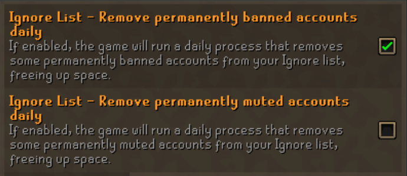

# Ignore List Ban Tracker 

A runelite plugin that tells you if reports you have made have led to permanent bans and mutes.

# Getting Started

Enable one or both of the settings in OSRS to start using the plugin

From here on, every time you log in, if any accounts have been automatically removed, you'll be treated to the following in the game chat:

`X users have been banned/muted from your ignore list since you were last logged in.`

So, simply report badly behaving users, and ensure you add them to your ignore list, and see the bans flow in!

# Image Sources

- Icon was obtained through ingame screenshots